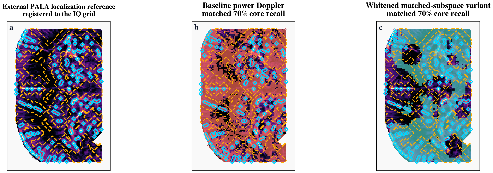
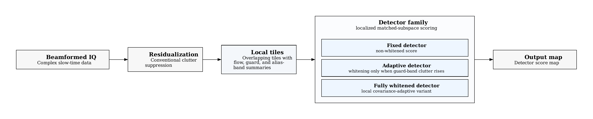
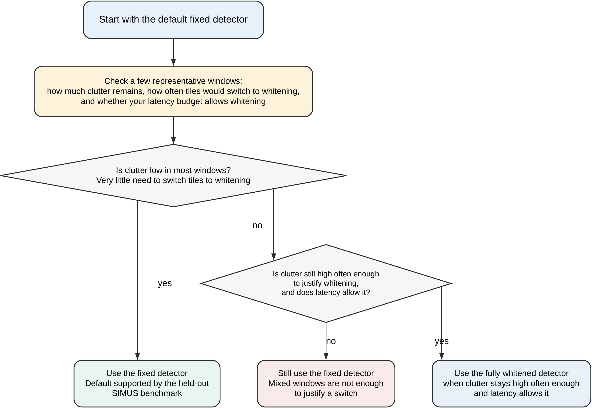

# fus-detectors

[](paper/preprint.pdf)
[](paper/methods_companion.pdf)
[](LICENSE)
[](https://github.com/ArthurShune/fus-detectors/actions/workflows/public_ci.yml)

Post-clutter-suppression detection statistics that reduce artifact leakage in functional ultrasound (fUS) and ultrafast Doppler maps, without changing the upstream clutter filter.

`fus-detectors` is the reference implementation and paper repository for localized matched-subspace detection on beamformed fUS slow-time data. If you are looking for functional ultrasound detection, fUS detection, or post-clutter-filter Doppler detection that can drop into an existing pipeline, this repo is the public implementation of that detector family. The central question is simple: once a clutter-filtered residual has been fixed, can changing only the final detection statistic suppress artifacts more effectively than power-Doppler-style readouts?

<p align="center">
  
</p>

## Can I Use This?

Use this repo if:
- your pipeline already produces complex beamformed slow-time IQ or a complex clutter-filtered residual cube
- you want to change only the final PD/Kasai-style readout, not redesign acquisition or clutter filtering
- you want same-residual comparisons between baseline PD and the detector family

This repo is probably not the right fit if:
- you only have sparse compounded magnitude frames and want end-to-end PD reconstruction
- you only have rendered Doppler images with no slow-time cube behind them
- you want a raw-channel beamformer or a new clutter filter rather than a downstream detector

Best first try:
- start with the `fixed` variant on the same clutter-filtered residual you already use for PD
- if you are unsure whether your data fit the public API contract, read [docs/integration.md](docs/integration.md) and [docs/troubleshooting.md](docs/troubleshooting.md) first

## What This Repo Adds

- A drop-in detector replacement for the final PD/Kasai-style readout in an existing clutter-filtered pipeline.
- A stable public API for running fixed, adaptive, and whitened detector variants on the same residual stream.
- A same-residual evaluation workflow for comparing detector behavior on synthetic, phantom, and real-IQ data.

In search terms, this repository is about downstream functional ultrasound detection, ultrafast Doppler detection statistics, artifact-aware Doppler readouts, and matched-subspace scoring for clutter-filtered residual data.

Two headline results anchor the repo:
- On the held-out `SIMUS-Struct-Intraop` benchmark, the fixed matched-subspace statistic reduces nuisance false-positive rate from `0.998` to `0.004` at matched recall `0.5` on the same clutter-filtered residual.
- On one open real-IQ rat-brain dataset, the fully whitened variant improves a conservative vessel-core versus perivascular-shell structural evaluation on all `10` evaluated blocks (`p = 0.002`).

## Performance / Replay Feasibility

Timing in this repo is reported in steady-state replay, excluding disk I/O and one-time startup overhead. Budget is defined as the acquired ensemble duration `N/PRF`. Under the reported replay conditions, the final manuscript configurations ran below budget across the labeled-brain, Shin, and Gammex evaluations (`RTF ~= 0.64-0.88`). In the 64-frame no-registration ULM configuration, total steady-state time was `41.3 ms` for a `64 ms` acquisition budget.

This is a replay-feasibility statement, not an end-to-end scanner-integration claim.

## Method at a Glance

<p align="center">
  
</p>

The method does not replace the upstream clutter filter. It changes only the final detection statistic applied to the same clutter-filtered residual. The default path is the fixed statistic, which adds no covariance estimation; whitening is optional and reserved for clutter-heavy settings.

> Status: active research code accompanying a preprint. APIs and helper scripts may still change. If you want to test this on raw fUS IQ, task data, or a clinical/mobile workflow, contact `arthur@skymesasystems.com`.

## Start Here

| If you want to... | Go here |
| --- | --- |
| Read the paper | [paper/preprint.pdf](paper/preprint.pdf) |
| See the full methods and companion analyses | [paper/methods_companion.pdf](paper/methods_companion.pdf) |
| Reproduce the headline figure and table | [scripts/reproduce_figure8_table7.sh](scripts/reproduce_figure8_table7.sh) |
| Integrate into an existing pipeline | [docs/integration.md](docs/integration.md) |
| Check whether your data are a good fit | [docs/troubleshooting.md#can-i-use-this-on-my-data](docs/troubleshooting.md#can-i-use-this-on-my-data) |
| Decide which detector variant to try first | [docs/integration.md#when-to-use-each-variant](docs/integration.md#when-to-use-each-variant) |
| Run the minimal public API example | [examples/minimal_integration.py](examples/minimal_integration.py) |
| See a PD-to-detector swap example | [examples/svd_pipeline_readout_swap.py](examples/svd_pipeline_readout_swap.py) |
| Troubleshoot common integration failures | [docs/troubleshooting.md](docs/troubleshooting.md) |
| Prepare datasets | [docs/data_download.md](docs/data_download.md) |
| Cite the work | [CITATION.cff](CITATION.cff) |

## Quick Start

```bash
conda env create -f environment.yml
conda activate fus-detectors
python scripts/verify_gpu.py
bash scripts/reproduce_figure8_table7.sh
```

After those commands, you will have the headline same-residual SIMUS figure and table used in the paper:
- `figs/paper/simus_detector_family_headline.pdf`
- `reports/paper/simus_detector_family_ablation_table.tex`

Full paper reproduction requires the datasets listed below. Helper scripts do not auto-download them.

## Library API

For drop-in use inside an existing clutter-filtered pipeline, use the stable
`fus_detectors` package rather than importing internal research modules.

```python
from fus_detectors import DetectorConfig, score_residual_cube

result = score_residual_cube(
    residual_cube,  # complex clutter-filtered residual, shape (T, H, W)
    prf_hz=3000.0,
    config=DetectorConfig(variant="fixed", device="cpu"),
)

readout_map = result.readout_map
score_map = result.score_map
summary = result.summary.to_dict()
```

The API returns a detector readout map, a score map, and a summary object for the same residual cube.

See [docs/integration.md](docs/integration.md) for the supported variants, the
public config surface, adaptive routing behavior, and the expected input/output
contract. A runnable end-to-end example is available at
[examples/minimal_integration.py](examples/minimal_integration.py). For a more
realistic “replace the final PD readout in an existing SVD pipeline” pattern,
see [examples/svd_pipeline_readout_swap.py](examples/svd_pipeline_readout_swap.py).

## Which Variant to Use

<p align="center">
  
</p>

Use the public variants this way:
- `fixed`: default starting point for new pipelines and the recommended first integration target.
- `adaptive`: same fixed statistic plus guard telemetry and selective promotion; useful when you want runtime monitoring without committing to full whitening everywhere.
- `whitened`: use when your acquisition repeatedly shows clutter-dominant windows and you can tolerate the extra compute.
- `whitened_power`: keep as a bounded ablation, not a default deployment choice.

The short integration rule is: start with `fixed`, check a few representative windows, and only move to `whitened` when clutter stays high often enough that whitening is worth the extra compute. The fuller rationale is in [docs/integration.md](docs/integration.md) and in the deployment flowchart in [paper/preprint.pdf](paper/preprint.pdf).

## Paper

Arthur Shune, *Localized Matched-Subspace Detection for Functional Ultrasound and Ultrafast Doppler Imaging*, preprint, 2026.

[[PDF]](paper/preprint.pdf) · [[Extended Methods]](paper/methods_companion.pdf) · [[Supplement]](paper/supplement.pdf)

Preprint archive DOI: [`10.5281/zenodo.19210732`](https://doi.org/10.5281/zenodo.19210732)

`arXiv link will be added once the preprint is posted.`

### Citation

```bibtex
@misc{shune2026localized,
  author = {Arthur Shune},
  title = {Localized Matched-Subspace Detection for Functional Ultrasound and Ultrafast Doppler Imaging},
  year = {2026},
  note = {Preprint},
  doi = {10.5281/zenodo.19210732},
  url = {https://doi.org/10.5281/zenodo.19210732}
}
```

Machine-readable citation metadata is also provided in [`CITATION.cff`](CITATION.cff).

## Common Failure Modes

Before assuming the detector “doesn’t work,” check these first:
- input is not complex slow-time IQ or a complex clutter-filtered residual cube
- axis order is wrong; the public API expects `(T, H, W)`
- PRF is wrong or missing, so the Doppler bands do not match the acquisition
- the ensemble is too short for your chosen parameters
- you are comparing against a different residual rather than doing a same-residual swap

The full checklist, including cases that are intentionally out of scope for this repo, is in [docs/troubleshooting.md](docs/troubleshooting.md).

## Reproduce the Main Results

### Fast path

```bash
bash scripts/reproduce_figure8_table7.sh
```

Use this if you want the shortest paper-facing smoke test.

### Full manifest

For the command manifest used to build the reported paper artifacts, see:
- [`repro_manifest.json`](repro_manifest.json)
- [`paper/methods_companion.pdf`](paper/methods_companion.pdf)

## Datasets

Paper-scale reproduction uses generated synthetic data plus staged open datasets under `data/`.

| Dataset | Used for | Size | Expected location |
| --- | --- | --- | --- |
| `SIMUS/PyMUST` synthetic benchmark | Held-out structural benchmark | generated locally | `data/` not required |
| `ULM Zenodo 7883227` | Real-IQ vessel-core vs shell audit | about `50 GB` | `data/ulm_zenodo_7883227/` |
| `Shin RatBrain Fig3` | Real-IQ proxy-motion audit | about `6.5 GB` | `data/shin_zenodo_10711806/` |
| `Twinkling artifact / Gammex phantom` | Phantom structural evaluation | about `13.5 GB` extracted | `data/twinkling_artifact/` |
| `Whole-brain mouse fUS atlas` | Optional companion-only retrospectives | about `0.7 GB` | `data/whole-brain-fUS/` |

Detailed download links, expected filenames, and provider-specific caveats are in [`docs/data_download.md`](docs/data_download.md).

## Requirements

- Linux or WSL with `conda` or `mamba`
- NVIDIA GPU with CUDA recommended for paper-scale runs
- RTX 4080 SUPER (`16 GB` VRAM) is the reference GPU for the reported latency measurements

## For Collaborators

This repository is set up for same-residual comparisons on new data without changing the upstream clutter filter.

If you have raw complex IQ, beamformed slow-time data, or task-driven fUS acquisitions, a practical collaboration would look like this:
- you provide raw data, acquisition metadata, and any existing task or structural reference
- this code runs the fixed, adaptive, and fully whitened statistics on your existing clutter-filtered residual pipeline
- we return configured code, evaluation outputs, and a reusable harness you can run on later datasets

Contact: `arthur@skymesasystems.com`

## Repository Map

- `paper/` manuscript sources and built PDFs
- `docs/assets/` curated README graphics and lightweight repo-facing visuals
- `fus_detectors/` stable install-facing API for third-party pipeline integration
- `pipeline/` detector statistics and clutter-filtered residual processing code
- `sim/` k-Wave and SIMUS simulation wrappers
- `scripts/` entry points for reported figures, tables, audits, and repro runs
- `reports/paper/` tracked tables used by the main preprint
- `reports/companion/` tracked tables used only by the companion/supplement
- `reports/` generated CSV summaries, logs, and audit artifacts
- `tests/` regression and unit tests

## License

This repository is released under the [MIT License](LICENSE).
